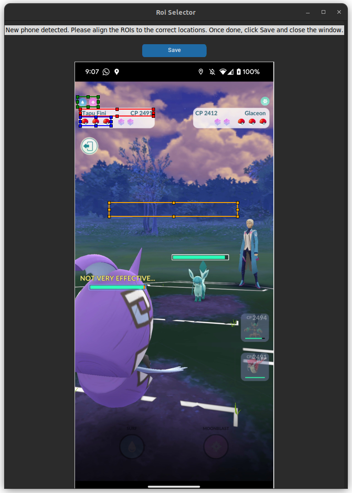

# Pokémon GO PVP Battle Assistant

(Work In Progress) This repository contains a Python script that assists players during Pokémon GO PVP battles. The script uses Pokémon and league-specific information from JSON files to display the move-set for each Pokémon, based on the recommended move-set from the PvPoke database. It also provides move counts and recommendations for move timings to help players avoid throwing moves on alignment.

# Features
* Auto league detection (Great, Ultra, or Master) based on the Pokémon's CP
* Displays the move-set suggested based on PvPoke recommendations and their counts
* Calculates and displays the best move timing to avoid throwing on alignment and giving opponent free turns
* Keeps track of the 3 Pokémons of each player. Highlights the current ones on the field with green
* Highlights fainted pokemon with red
* End of match auto detection that resets the UI after a countdown in preparation for the next match. Keeps the same league previously chosen.
* A counter for opponent switch cooldown
* Dropdown menu for currently available specific meta cups imported from PvPoke
* Dropdown menus to choose which form of pokemon (if available) is currenlty on the field, and for fast and charge moves that updates based on the chosen moves
* Screen recording functionality
* Energy accumulation tracking along with energy deduction when charge moves are thrown (not accurate - needs further work)
* Saves seen Pokémons to a battle records CSV file

# To-Do
* <del> Automate finding the ROI location for Pokémon information to make it work with any phone / resolution
* <del> Add a way for user to specify the league in the UI (currently not able to work with custom leagues)
* <del> Add memory and display all opponent Pokémon seen so far
* Implement CV/ML (YOLO) to detect Pokémon and actual move-sets from in-game animations
* Keep track of actual energy each Pokémon has during battle
* <del> Auto update json files from PvPoke
* <del> Add a count down from 60 seconds when the opponent switches Pokémon to know when they are no longer locked in
* <del> Fix switch cool down bug when opponent pokemon faints
* <del> Try a non CV/dummy energy counter based on time elapsed (fast move energy gain/ cooldown, and the charge moves energy requiremnt)
* <del> Add drop down menu for pokemon with multiple forms
* <del> Add drop down menu for modifying the fast move, that would update the charge move counts accordingly
* <del> Find a way to keep track of when pokemon faint
* Improve pokemon switch detection
* <del> Add "update" button for moveset/cups to the UI. Add cooldown timer to avoid hitting the request limit
* <del> Implement debugging window for ROIs
* Create a section for current pokemons analytics: who wins CMP, damage % for each charge move, battle ratings in each shield scenario
* Augment energy accumulation with my charge move circles CV processings

# Installation
NOTE: Only works for Android devices. Connect your phone to your computer and allow for USB Debugging in your Developer Settings:

1. Clone the repo:
```
git clone git@github.com:basemprince/pogo-bot.git
```
2. Navigate to the cloned repository and run the setup script which installs
   required dependencies and creates the conda environment:
```
cd pogo-bot
./setup.sh           # Linux/macOS
```
   On Windows run `setup.bat` instead. The environment installs `ipykernel` for
   notebook support and `pyautogui` for GUI automation used in some example
   notebooks.
3. In `main.py`, edit the phone variable to add the name of your phone, and
   find the correct `roi_adjust` values that match your phone resolution to put
   the ROI on the correct location as shown in the picture below. This will be
   a trial and error process.

4. Ensure the `adb` server is running (`adb start-server`). The app will print a
   helpful message if `adb` cannot be found in your `PATH`.

5. Run the main script. On first run the app downloads data from PvPoke if the
   files are missing, so it might take a few minutes:
```
python main.py
```
6. A UI will show up to set up the correct locations of the ROI if it's a phone
   that was not previously used. Play through a match and take screenshots of the
   battle and when a message is displayed in the middle. Align the boxes to the
   correct locations, click save and close window:
<p align="center">

</p>


7. Now, the battle assistant should show up in a new window as shown:
<p align="center">

</p>

# Dockerfile steps (Linux)
If you would like to run the app using a docker container instead, after installing the docker engine run the following:
```
sudo docker build -t pogo-bot .
xhost +local:
sudo docker run --net="host" -e DISPLAY=unix$DISPLAY pogo-bot

```

# Dockerfile steps (Windows)
A bit more convoluted, please follow these steps:

1. **Install Docker Desktop**: Download and install from [Docker's website](https://www.docker.com/products/docker-desktop).
2. **Download Android SDK Platform Tools**: Get them [here](https://developer.android.com/tools/releases/platform-tools) and run `adb start-server` from within the `platform-tools` folder.
3. **Run the following commands from PowerShell**:
   ```powershell
   docker-compose up --build
   docker run -it -v /run/desktop/mnt/host/wslg/.X11-unix:/tmp/.X11-unix -v /run/desktop/mnt/host/wslg:/mnt/wslg -e DISPLAY=:0 -e WAYLAND_DISPLAY=wayland-0 -e XDG_RUNTIME_DIR=/mnt/wslg/runtime-dir -e PULSE_SERVER=/mnt/wslg/PulseServer pogo-pvp-assistant-img
