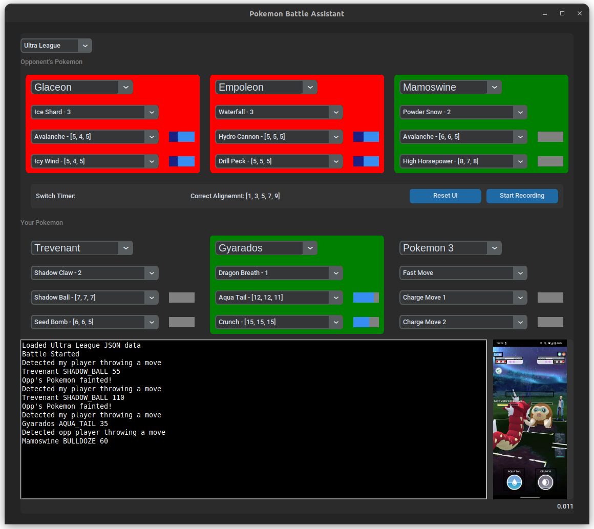

# Pokémon GO PVP Battle Assistant

(Work In Progress) This repository contains a Python script that assists players during Pokémon GO PVP battles. The script uses Pokémon and league-specific information from JSON files to display the move-set for each Pokémon, based on the recommended move-set from the PvPoke database. It also provides move counts and recommendations for move timings to help players avoid throwing moves on alignment.

# Features
* Auto league detection (Great, Ultra, or Master) based on the Pokémon's CP
* Displays the move-set suggested based on PvPoke recommendations and their counts
* Calculates the best move timing to avoid throwing on alignment and giving opponent free turns
* Shows the last 3 opponent Pokémon seen 
* A counter for the opponent switch out timer

# To-Do
* Automate finding the ROI location for Pokémon information to make it work with any phone / resolution
* Add a way for user to specify the league in the UI (currently not able to work with custom leagues)
* <del> Add memory and display all opponent Pokémon seen so far
* Implement CV/ML (YOLO) to detect Pokémon and actual move-sets from in-game animations
* Keep track of actual energy each Pokémon has during battle
* <del> Auto update json files from PvPoke
* <del> Add a count down from 60 seconds when the opponent switches Pokémon to know when they are no longer locked in


# Installation
NOTE: Only works for Android devices. Connect your phone to your computer and allow for USB Debugging in your Developer Settings:

1. Clone the repo: 
```
git clone git@github.com:basemprince/pogo-bot.git
```
2. Navigate to the cloned repository and install the required Python packages:
```
cd pogo-bot
sudo apt-get install tesseract-ocr
pip install -r requirements.txt
```
4. In main.py, you need to edit the phone variable to add the name of your phone, and find the correct roi_adjust values that matches your phone resolution to put the roi on the correct location as shown in picture below. This will be a trial and error

5. Run the main script:
```
python main.py
```
Now, the pogo-bot should show up in a new window as shown:
<p align="center">

</p>
